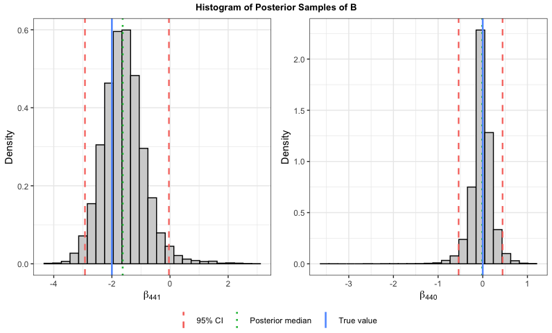

# CoMET: A Compressed Bayesian Mixed-Effects Model for High-Dimensional Tensors

This repositary contains:

1.  **R package BayesCoMET**
    - Implements the Compressed Bayesian Mixed-Effects Model for Tensors
      (CoMET).
    - Install this library with:

    ``` r
    devtools::install_github("SreyaSarkar21/BayesCoMET")
    library(BayesCoMET)
    ```
2.  **Others Folder**
    - contains the codes implementing the competing methods.
    - `sampler_Oracle.R` contains the code for oracle, the Bayesian
      oracle benchmark of CoMET, where the true random-effects
      covariance structure is known.
    - `fanli2012.R` contains the code for implementing the penalized
      quasi-likelihood method for fixed effects selection by \[1\].
    - `licaili2021.R` contains the code implementing the penalized
      quasi-likelihood estimation and inference procedures for fixed
      effects selection by \[2\], using their published supplementary
      code as a reference.
    - `gee_cv.m`, `gee_equicorr_predict.m`, `gee_run_DEAM.m` are the
      MATLAB codes using the SparseReg MATLAB library for implementing
      the GEE approach \[3\].

## Example Implementation of CoMET

``` r
library(BayesCoMET)
pdims <- qdims <- c(32, 32)
n_train <- 100; n_test <- 50; m <- 3 ## 3 observations per subject

library(BayesCoMET)

## Generating a  CP-structured fixed-effect coefficient
cp_decomp_B <- BayesCoMET:::generate_cpB_with_sparse_factors(pdims = c(32, 32), K = 4,
                                                             sparsity = 0.25, seed = 123)
trueB <- cp_decomp_B$B

## Equicorrelation covariance matrices per tensor-mode
equicorr_mat <- function(q, rho) {
    if(rho < -1/(q-1) | rho > 1) {
        stop(sprintf("For q = %d, rho must be in [-1/(q-1), 1] for postive semi-definiteness.", q))
    }
    Sigma <- matrix(rho, q, q)
    diag(Sigma) <- 1
    Sigma
}

Sigma1 <- Sigma2 <- equicorr_mat(q = 32, rho = 0.5)
L1 <- chol(Sigma1); L2 <- chol(Sigma2)

## Simulating data with 150 subjects each with cluster size m
dat <- BayesCoMET:::simdata(pdims = c(32, 32), qdims = c(32, 32), n = 150, m = 3,
                            errVar = 0.1, B = trueB, L_list = list(L1 = L1, L2 = L2),
                            xcov_var = 1, zcov_var = 1, myseed = 1)

## Taking first 100 subjects for training and the rest for validation
y_train <- dat$yijs[1:(n_train * m)]; y_test <- dat$yijs[(n_train * m + 1):length(dat$yijs)]
xlist_train <- dat$Xijlist[1:(n_train * m)]; xlist_test <- dat$Xijlist[(n_train * m + 1):length(dat$yijs)]
zlist_train <- dat$Zijlist[1:(n_train * m)]; zlist_test <- dat$Zijlist[(n_train * m + 1):length(dat$yijs)]
nmodes <- length(pdims)

## Implement CoMET model Gibbs sampler
kdims <- rep(3, nmodes)
set.seed(12345)
R_list <- lapply(1:nmodes, function(d) {matrix(rnorm(kdims[d] * qdims[d], 0, sd = sqrt(1/kdims[d])), kdims[d], qdims[d])})
S_list <- lapply(1:nmodes, function(d) {matrix(rnorm(kdims[d] * qdims[d], 0, sd = sqrt(1/kdims[d])), kdims[d], qdims[d])})

res <- BayesCoMET::comet(y = y_train, xlist = xlist_train, zlist = zlist_train,
                         mis = rep(n_train, m),
                         K = 6, kdims = kdims, a0 = 0.01, b0 = 0.01, gammaVar0 = c(1, 1),
                         R_list = R_list, S_list = S_list,
                         niter = 11000, nburn = 1000, nthin = 1, store_ranef = TRUE)
```

    ## iteration:  1000 
    ## iteration:  2000 
    ## iteration:  3000 
    ## iteration:  4000 
    ## iteration:  5000 
    ## iteration:  6000 
    ## iteration:  7000 
    ## iteration:  8000 
    ## iteration:  9000 
    ## iteration:  10000 
    ## iteration:  11000

``` r
## Time taken ##
res$sampler_time
```

    ##    user  system elapsed 
    ## 474.975  13.994 487.709

``` r
betaPostMed <- apply(res$betaSamp, 2, median)
vecB_true <- as.vector(trueB)

vecB_true
```

    ##    [1]  0  0  0  0  0  0  0  0  0  0  0  0  0  0  0  0  0  0  0  0  0  0  0  0
    ##   [25]  0  0  0  0  0  0  0  0  0  0  0  0  0  0  0  0  0  0  0  0  0  0  0  0
    ##   [49]  0  0  0  0  0  0  0  0  0  0  0  0  0  0  0  0  0 -2  0 -1 -2  2  1  2
    ##   [73]  1 -4 -1  2  1 -2  2  0  2  0 -2  2  0  0  0  0  0 -2  0 -1  2  0  1  4
    ##   [97]  0  0  0  0  0  0  0  0  0  0  0  0  0  0  0  0  0  0  0  0  0  0  0  0
    ##  [121]  0  0  0  0  0  0  0  0  0 -2  0 -1 -2  2  0  2  1 -2 -1  2  0 -2  0  0
    ##  [145]  2  0 -2  0 -1  0  0  0 -2  0  0 -1  2  0  1  4  0  0  0  0  0  0  0  0
    ##  [169]  0  0  0  0  0  0  0  0  0  0  0  0  0  0  0  0  0  0  0  0  0  0  0  0
    ##  [193]  0  0  0  0  2  0  0 -2  0  2  0 -2  0  2  0  0 -2  0  2  0  0  0  0  0
    ##  [217]  2  0  0  0 -2  0  0 -4  0  4  0  2  0 -4 -2  0 -6  0  2  0  0  0  2  0
    ##  [241]  0  0  0  0  2  0  4  0  0  0 -4  2  0  0 -2 -4  0  0  0  0  0  0  0  0
    ##  [265]  0  0  0  0  0  0  0  0  0  0  0  0  0  0  0  0  0  0  0  0  0  0  0  0
    ##  [289]  0  0  0  0  0  0  0  0  0  0  0  0  0  0  0  0  0  0  0  0  0  0  0  0
    ##  [313]  0  0  0  0  0  0  0  0  0  0  0  0  0  0  0  0  0  0  0  0  0  0  0  0
    ##  [337]  0  0  0  0  0  0  0  0  0  0  0  0  0  0  0  0  0  0  0  0  0  0 -2  0
    ##  [361] -4  0  0  0  0  0  2  0  0  0  0  0  0  0  4  0  0  0 -4  0  0  0  0 -4
    ##  [385]  0  0  0  0  0  0  0  0  0  0  0  0  0  0  0  0  0  0  0  0  0  0  0  0
    ##  [409]  0  0  0  0  0  0  0  0  0  0  0  0  0  0  0  0  2  2  0  0 -1  0 -3  0
    ##  [433]  0  0  0 -2 -1  0 -2  0 -2  2  2  0  0  0  0  2  0  0  0  0 -1  0  0  1
    ##  [457]  0 -1  0  1  0 -1  0  0  1  0 -1  0  0  0  0  0 -1  0  0  0  1  0  0  2
    ##  [481]  0  0  0  0  0  0 -1  0  0  2  0  0 -1  0 -2  0  0  0  0 -2 -1  0  0  0
    ##  [505] -2  2  0  0  0  0  0  0  0  0  0  0  0  0  0  0  0  0  0  0  0  0  0  0
    ##  [529]  0  0  0  0  0  0  0  0  0  0  0  0  0  0  0  0  0  0  0  0  0  0 -1  0
    ##  [553]  0  2  0  0 -1  0 -2  0  0  0  0 -2 -1  0  0  0 -2  2  0  0  0  0  0  0
    ##  [577]  0 -4  0 -2  0  4  2  0  2 -4 -2  0  2  0  4  0  0  0  0  4  0  0  0  0
    ##  [601]  4 -4  0 -2  0  0  2  0  0  2  0  1  0 -2  0  0 -1  0  1  0  0  0  0  0
    ##  [625]  0  0  0  0  1  0  0  0  0  0  0  1  0  0 -1  0  0  0  0  0 -2  0  0  2
    ##  [649]  0 -2  0  2  0 -2  0  0  2  0 -2  0  0  0  0  0 -2  0  0  0  2  0  0  4
    ##  [673]  0  0  0  0  0  0  3  0  4 -2  0  0  1  0  0  0  0  0  0  2  1  0 -4  0
    ##  [697]  2 -2  4  0  0  0  0  4  0  0  0  0  1  0  1 -1  2  1  0 -1  0  1 -1  0
    ##  [721] -1  0  1  0  0  0 -2  0  1  0  2  0 -1  0  0  0  0  0  0  0  0  0  1  0
    ##  [745]  0 -2  0  0  1  0  2  0  0  0  0  2  1  0  0  0  2 -2  0  0  0  0  0  0
    ##  [769]  0  0  0  0 -1  0  2  1  4 -1  0  1  0 -1 -2  0  1  0 -1  0  0  0 -4  0
    ##  [793] -1  0  4  0  1  0  0  6  0  0  0  0  0  0  0  0  0  0  0  0  0  0  0  0
    ##  [817]  0  0  0  0  0  0  0  0  0  0  0  0  0  0  0  0  0  0  0  0  0  0  0  0
    ##  [841]  0  0  0  0  0  0  0  0  0  0  0  0  0  0  0  0  0  0  0  0  0  0  0  0
    ##  [865]  0  0  0  0  0  0  0  0  0  0  0  0  0  0  0  0  0  0  0  0  0  0  0  0
    ##  [889]  0  0  0  0  0  0  0  0  0  0  0  0  1  0  2 -1  0 -3  0 -1  2  1  4  0
    ##  [913] -1  0  1  4  2  0  0  0  5 -4  0  0 -1  0  0 -2  0  0  0  0  0  0 -2  0
    ##  [937] -4  0  0  0  0  0  2  0  0  0  0  0  0  0  4  0  0  0 -4  0  0  0  0 -4
    ##  [961]  0  0  0  0  0  0  1  0  2  0  0  0  0  0 -1  0  0  0  0  0  0  0 -2  0
    ##  [985]  0  0  2  0  0  0  0  2  0  4  0  2  1 -4  2 -1  2  1  2 -1  0  1 -2  0
    ## [1009] -1  0  1  0  2  0 -4  0  1  0  4  2 -1  0 -2  2

<!-- -->

## Acknowledgement

Sreya Sarkar was supported by the National Science Foundation grant
DMS-1854667 for this work.

## Citation

If you use *BayesCoMET* in your work, please cite: Sarkar, S., Khare,
K., & Srivastava, S. (2026). **CoMET: A Compressed Bayesian
Mixed-Effects Model for High-Dimensional Tensors.** *arXiv.*
<https://arxiv.org/pdf/2602.19236>

## Other References

\[1\] Fan, Y., & Li, R. (2012). **Variable Selection in Linear Mixed
Effects Models.** *The Annals of Statistics*, Vol. 40, No. 4,
pp. 2043–2068. DOI:
[10.1214/12-AOS1028](https://doi.org/10.1214/12-AOS1028).

\[2\] Li, S., Cai T. T., & Li, H. (2022). **Inference for
High-Dimensional Linear Mixed-Effects Models: A Quasi-Likelihood
Approach.** *Journal of the American Statistical Association*, 117(540),
1835–1846. DOI:
[10.1080/01621459.2021.1888740](https://doi.org/10.1080/01621459.2021.1888740).

\[3\] Zhang X., Li, L., Zhou, H., Shen, D., et al. (2019). **Tensor
generalized estimating equations for longitudinal imaging analysis.**
*Statistica Sinica*, 29(4), 1977-2005. DOI:
[10.5705/ss.202017.0153](https://doi.org/10.5705/ss.202017.0153).
